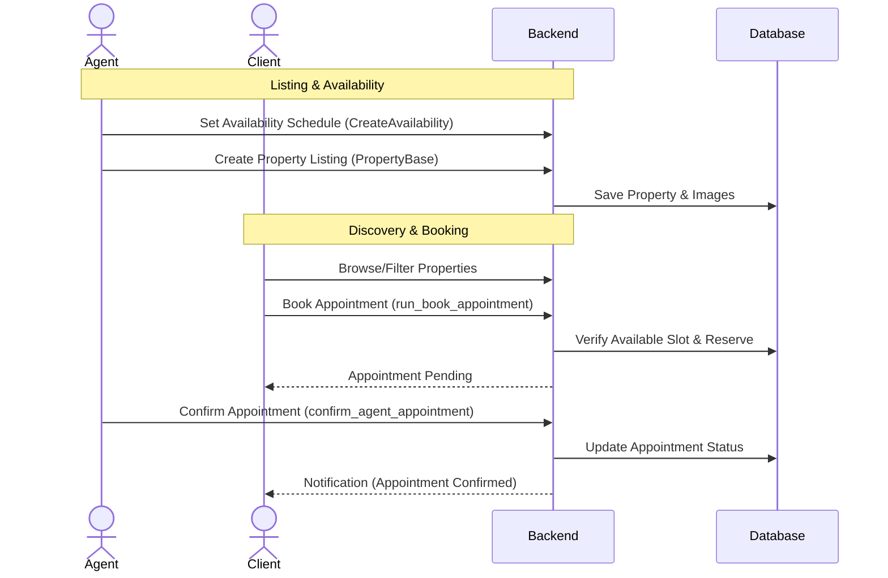
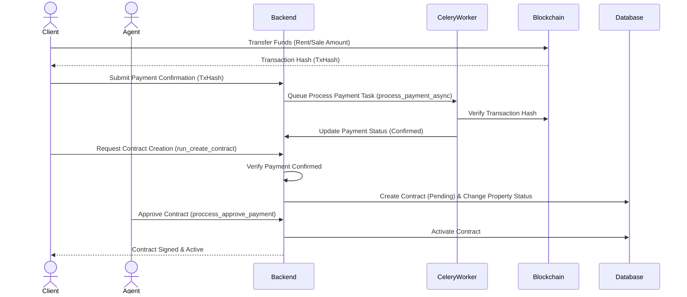
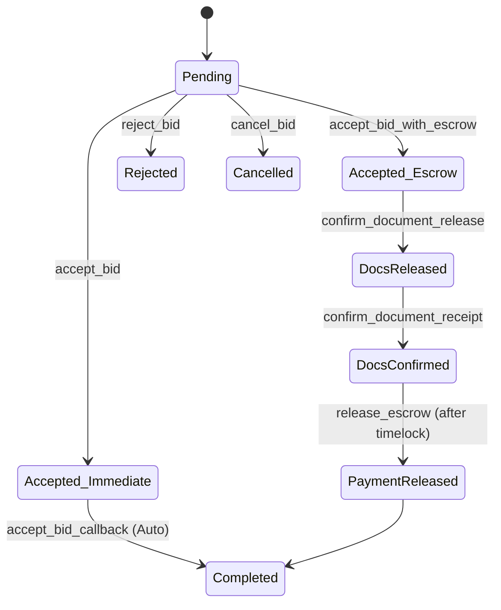
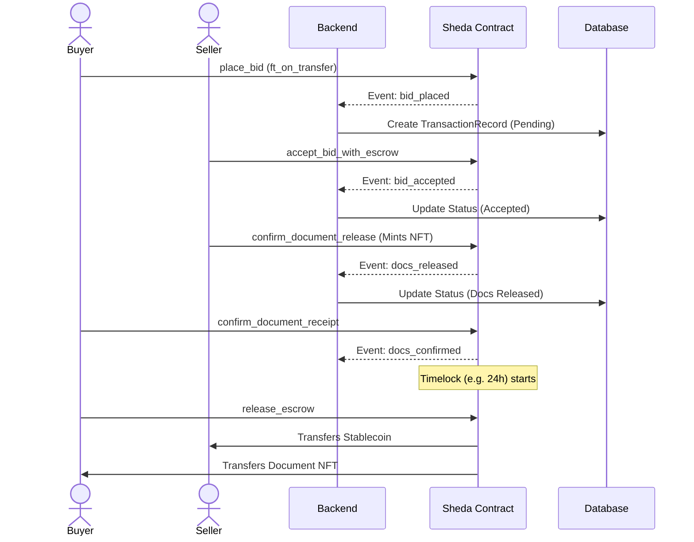
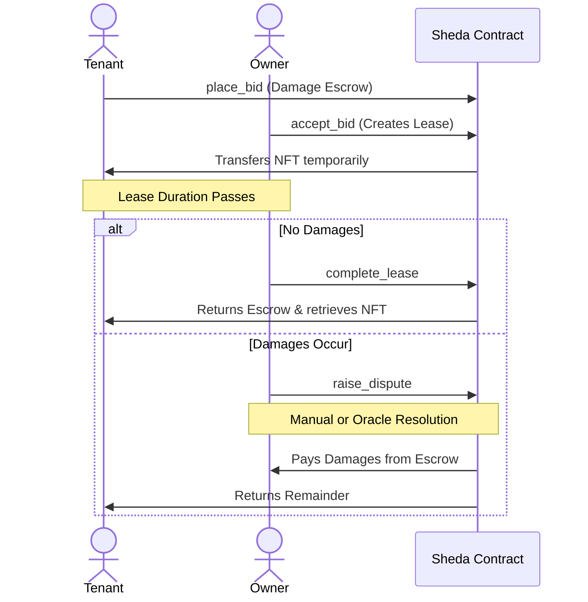
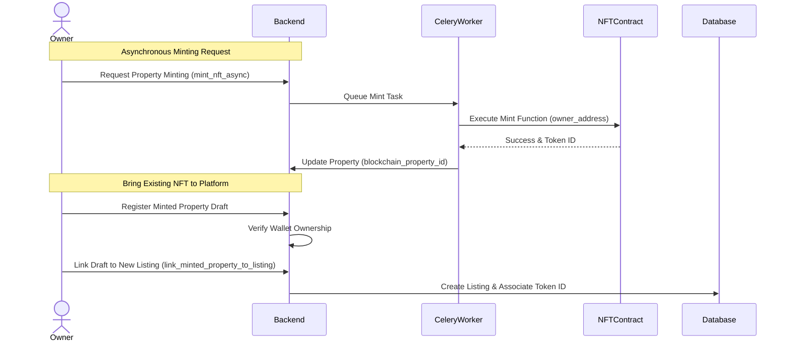

# Sheda Architecture & Application Flows

This document details the expected core flows of the Sheda application, including user interactions, contract formation, and where/how the platform integrates with the blockchain (focused on Near/TON smart contracts).

## 1. Property Operations & Appointments Flow

This is the standard Web2 workflow where agents list properties and clients can schedule viewings.

## 2. Standard Contract & Payment Flow

When a client wants to rent or buy a property without full on-chain escrow, they can make a payment that is verified by the backend. Once verified, a contract is generated.

## 3. Blockchain Escrow Flow (Transactions)

For completely trustless transactions, Sheda utilizes a blockchain escrow system. The smart contract (`sheda_contract`) manages the escrow and enforces state machines for both Purchase and Lease actions.

### Purchase Flow (Dual-Path Acceptance)

#### Path A: Immediate Acceptance

For trusted or simple transactions, the seller uses `accept_bid`.

1. **Bid Placed**: Buyer transfers funds to the contract (`ft_on_transfer`).
2. **Acceptance**: Seller calls `accept_bid`.
3. **Execution**: The contract immediately transfers the escrowed stablecoin to the seller and mints/transfers the document NFT to the buyer.

#### Path B: Escrowed Staged Release

For higher security, the seller uses `accept_bid_with_escrow`.

1. **Bid Placed**: Buyer transfers funds to contract.
2. **Acceptance**: Seller calls `accept_bid_with_escrow`.
3. **Document Release**: Seller creates/mints the document NFT (`confirm_document_release`).
4. **Buyer Confirmation**: Buyer verifies the document (`confirm_document_receipt`). This starts a time-lock (default 24 hours).
5. **Release**: After the timelock expires, the buyer explicitly releases the funds (`release_escrow`).

## 4. Lease Escrow & Dispute Flow

When a property is leased, the bid amount serves as the *damage escrow*.

1. **Lease Bid**: Tenant bids on a property flagged for lease.
2. **Acceptance**: Owner accepts bid. A `Lease` record is created, and the escrow is held separately by the contract.
3. **During Lease**: The tenant holds the document NFT temporarily.
4. **Resolution**: If disputes arise (e.g., damages), `raise_dispute` is called. It can be resolved manually or via oracle (`resolve_dispute_with_oracle`). Otherwise, at `complete_lease`, the escrow is returned.

## 5. Property NFT Minting & Linking

Sheda allows properties to be tokenized (minted as NFTs) for proof of ownership and on-chain trading.

### Integration Points Summary

- **Wallet Auth/Mapping**: Users map their on-chain wallets (e.g. Near/TON) to their profile (`WalletMapping`).
- **Payment Verification**: Traditional payments or direct transfers are verified asynchronously via `process_payment_confirmation` Celery task.
- **Escrow Contracts**: Handled by the `sheda_contract`. Includes features like `accept_bid_with_escrow`, `confirm_document_release` for NFT minting, and configurable timelocks (`escrow_release_delay_ns`).
- **Background Sync**: Polling tasks (`sync_blockchain_events` and `check_payment_timeouts`) keep the backend database transaction records in sync with the smart contract state.
